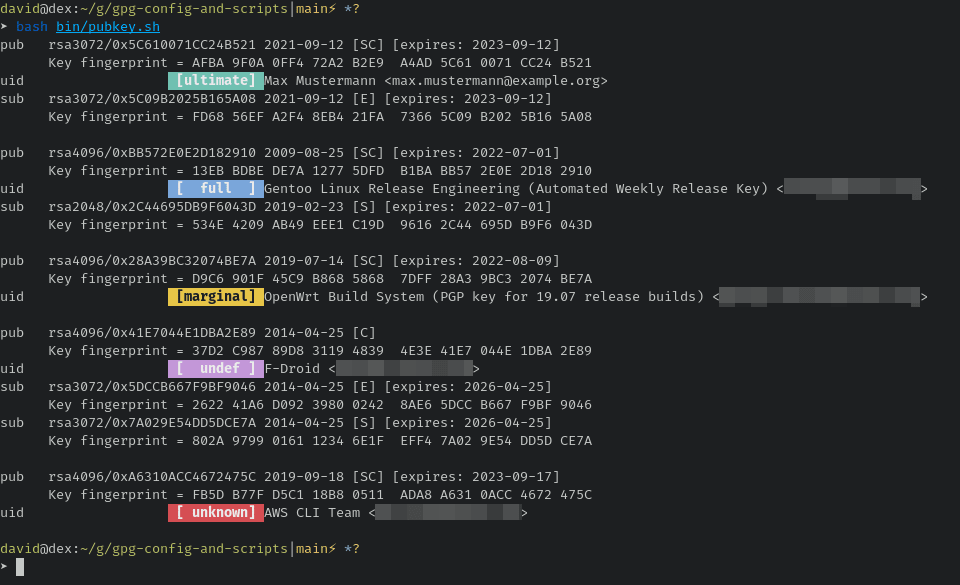
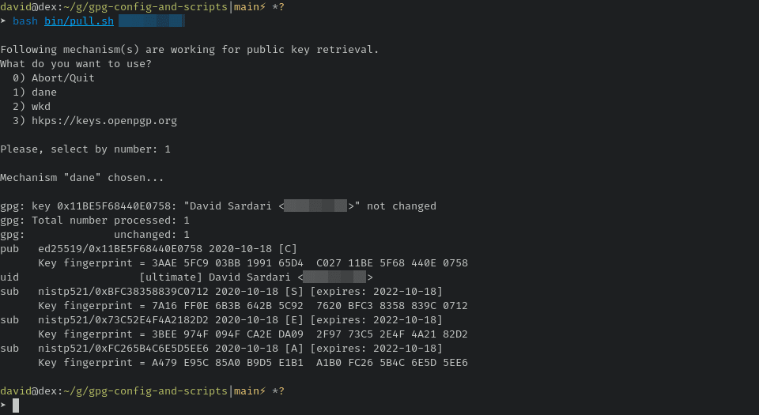

# My GnuPG configuration and some helper scripts

## System requirements

⚠️ Everything in this Git repo has been **tested only with GnuPG 2.2.x (LTS)**. Certain config options are invalid in GnuPG 2.3.x (stable) and defaults might differ!

Otherwise, the scripts in `bin/` should work out of the box on common Linux systems.

MacOS, however, needs these [HomeBrew](https://brew.sh) packages installed:

- `findutils`
- `gnu-sed`

## Understand the GnuPG configuration

You need to comment out `default-key` in `gpg.conf` OR set the ID of one of your secret keys.

- To print personal key IDs in `long` format:

```bash
gpg --list-options show-only-fpr-mbox --list-secret-keys
```

- To better understand GnuPG config options:


```bash
# print man.sh help
bash bin/man.sh

# bash bin/man.sh -c dirmngr.conf|gpg-agent.conf|gpg.conf|scdaemon.conf|orAnyOtherGpgConf [-f]
bash bin/man.sh -c /path/to/gpg.conf

# print full manpage with config file options highlighted red
bash bin/man.sh -c gpg.conf -f

# If "less" doesn't to show any colors, use the "-r" (--raw-control-chars) flag
bash bin/man.sh -c gpg.conf -f | less -r
```

## List public keys and delete untrusted ones

Public keys are listed from top to bottom, colored and grouped by following trust levels:

1. `ultimate`
2. `full`
3. `marginal`
4. `undefined`
5. The rest: `unknown`, `expired`, `never trust`, `revoked` and `error`

- To print the list:



```bash
bash bin/pubkey.sh
```

- To delete any public key without trust level `ultimate`, `full`, `marginal` and `undefined` you have to pass the `-d` flag. You will be prompted and must confirm the deletion of each public key.


```bash
bash bin/pubkey.sh -d
```

## Pull public keys

GnuPG offers multiple mechanism to pull a public key. Following script tries out a predefined list of mechanism and lets you choose one of them for pulling the public key:



```bash
# print pull.sh help
bash bin/pull.sh

# pull a certain key
bash bin/pull.sh <KEY ID>
```
